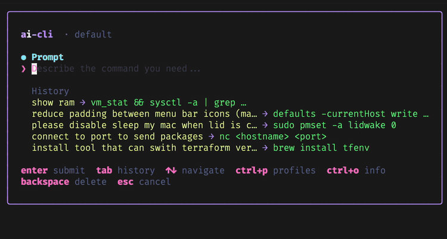

# ai-cli

Press **Ctrl+A**, say what you need in plain language — get a shell command in your prompt. Nothing runs until you press Enter.

Works with OpenAI-compatible APIs (OpenAI, Ollama, OpenRouter, etc.).



## Install

**Homebrew**

```bash
brew install karpulix/tools/ai-cli
```

**Binary** — download from [Releases](https://github.com/karpulix/ai-cli/releases), extract, add to `PATH`.

**From source** (Go 1.25+)

```bash
git clone https://github.com/karpulix/ai-cli.git
cd ai-cli && go build -o ai-cli .
sudo mv ai-cli /usr/local/bin/
```

### Shell integration

`ai-cli install zsh` adds a widget to `~/.zshrc` and registers **Ctrl+A** to open the TUI from your prompt. Re-run after moving the binary — it updates the path automatically.

```bash
ai-cli install zsh
source ~/.zshrc   # or open a new terminal
```

For bash: `ai-cli install bash` and `source ~/.bashrc`.

The command is inserted into your prompt line, not executed. Review it, then press Enter.

## Setup

1. Run `ai-cli` — if no profile exists, the profile manager opens.
2. Or: `ai-cli config set-key` to create a default profile.

Manage profiles in the TUI: **Ctrl+P** (add, switch, delete). Each profile has API key, model, and optional base URL (for Ollama: `http://localhost:11434/v1`).

Config and history are stored automatically:

- macOS: `~/Library/Application Support/ai-cli/`
- Linux: `~/.config/ai-cli/`

## Usage

**From the shell:** Ctrl+A → describe command → Enter → command appears in your prompt.

**Standalone:** `ai-cli`

| Command | Description |
|---------|-------------|
| `ai-cli --version` | Version |
| `ai-cli config set-key` | Create default profile |
| `ai-cli config refresh-prompt` | Reset prompt template |
| `ai-cli install zsh\|bash` | Add shell widget |
| `ai-cli init zsh\|bash` | Print widget snippet |

## Shortcuts

| Key | Action |
|-----|--------|
| `Enter` | Generate command |
| `Tab` | Prompt ↔ History |
| `Ctrl+P` | Profiles |
| `Ctrl+O` | Info (paths, version, system) |
| `Ctrl+N` | New profile (in profile manager) |
| `Esc` | Cancel / close panel |

## Prompt template

Stored in `config.json` as `prompt_template`. Use `{system_info}` — OS and shell are filled in at request time.

## Platform notes

Shell widget (Ctrl+A) works on macOS and Linux with zsh/bash. TUI runs on Windows in a terminal, but without shell integration.

---

Developers: [BUILD_AND_DEPLOY.md](BUILD_AND_DEPLOY.md)
